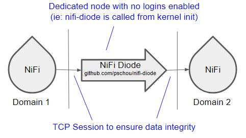

# NiFi Diode
Super simple NiFi Diode that does one thing, takes in data and passes it on to
another NiFi without letting anything go the other direction.  Hence it's a
simple, no-cache-diode.

The idea here is this server listens on a ip:port and then any incomming
connection is streamed to another ip:port, but data can only transfer one way.
The sending side will have no idea what server it is sending to nor be able to
get any information from the downstream NiFi.


## Why do I need this?

Imagine, if you will, you need to get data into a secure environment, a
hospital network with 3128 windows machines.  Well, to be more specific,
windows software updates.  With all the HIPAA regulations, how can you get this
regular flow of patches into the network?  Well, the tool of choice is NiFi...
But, how often can people make a mistake and leave a NiFi open/unsecured?  One
accident is too often.

So, we need a super-secure, no accidents allowed, flow.  How do you do this
task of bringing in updates while ensuring that data has no chance of escaping
the network?  Enter stage right, nifi-diode.  This tool has a good resume:

- Free and open-source (FOSS is good)
- Has a memory footprint of 10-50 MB (It runs on cheap hardware)
- Can run directly from a kernel INIT= call (no one can break in!)
- Place a box in a locked server room and by denying physical access, you effectively prohibit data from going the wrong way (It's a win-win!)
- Threadable, multiple concurrent flows can help with latency issues

What are the pitfalls?

- If the server dies, who knows for what reason, you need to get to the physical server to restore the diode (which seems like a good risk)
- It's command line, so you have to know Linux (my manager included this, but techies should know Linux)
- If you like burning all your data to a DVD and sneaker netting it between buildings, you'll have to find a gym now.  :(



Moving data between domains with a "FOSS Hardware" solution.

## Usage
```
$ ./nifi-diode -h
Simple NiFi Diode (github.com/pschou/nifi-diode)
Apache 2.0 license, for personal use only, provided AS-IS -- not responsible for loss.
Usage implies agreement.  Version: 0.1.20220711.0845

Usage: ./nifi-diode [options...]

Option:
  --debug               Verbose output
Listener options:
  --listen HOST:PORT    Incoming/listen address for diode  (Default: ":7443")
  --secure-incoming BOOL  Enforce minimum of TLS 1.2 on server side  (Default: true)
  --tls-incoming BOOL   Enable listener TLS  (Default: true)
  --verify-incoming BOOL  Verify incoming connections, do certificate checks  (Default: true)
Target options:
  --host FQDN[:PORT]    Hostname for output/target NiFi - This should be set to what the target is expecting  (Default: "")
  --secure-target BOOL  Enforce minimum of TLS 1.2 on client side  (Default: true)
  --target HOST:PORT    Output/target address for diode  (Default: "127.0.0.1:443")
  --tls-target BOOL     Enable output TLS  (Default: true)
  --verify-target BOOL  Verify target, do certificate checks  (Default: true)
Certificate options:
  --ca FILE             File to load with ROOT CAs - reloaded every minute by adding any new entries
                          (Default: "/etc/pki/ca-trust/extracted/pem/tls-ca-bundle.pem")
  --cert FILE           File to load with CERT - automatically reloaded every minute
                          (Default: "/etc/pki/server.pem")
  --key FILE            File to load with KEY - automatically reloaded every minute
                          (Default: "/etc/pki/server.pem")
```

## Example usags

```
$ ./nifi-diode --host software-server.mydomain.edu:8000 --target http://software-server.mydomain.edu:8000 --tls-target false --tls-incoming true --cert /etc/pki/server.pem --key /etc/pki/server.pem --ca /etc/pki/CA.pem
```

In this example, the Domain 1 side is encrypted with an internal signed cert
and Domain 2 is unencrypted.  One can turn on or off encryption on either side.
The reason why encryption is turned on for the Domain 1 is to ensure the
connection is established by our NiFi box and not another system on the same
public network.  Internally, the encryption is not needed as the system sits
inside the same server room as the software-server
